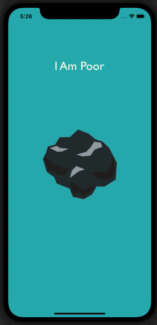

# I-Am-Poor
This is a Simple iOS application named "I Am Poor" that shows a screen which i have made during learning about designing an iOS application using UI Builder elements in Main.storyboard(Xcode).

## What i have learned while building "I Am Rich" application ?

--> Designing the app in Xcode using Interface Builder(iOS Components).

--> How to add custom image assets to Xcode projects.

--> Resizing and Arranging of various UI Elements.

--> How to create app icons and size them for all resolutions.

--> How to run apps on the iOS Simulator as well as sideload to a physical device.

## Screenshots

